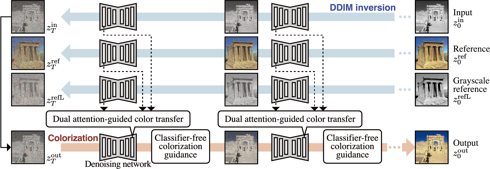

# Leveraging the Powerful Attention of a Pre-trained Diffusion Model for Exemplar-based Image Colorization

This is the official implementation of the paper in TCSVT.

<p align="left">

</p>

## Setup
### Create a Conda Environment
```Shell
conda env create -f environment.yaml
conda activate Colorization
```

### Download StableDiffusion Weights
Download the StableDiffusion weights from the [CompVis organization at Hugging Face](https://huggingface.co/CompVis/stable-diffusion-v-1-4-original) (download the sd-v1-4.ckpt file), and link them:
```Shell
ln -s <path/to/model.ckpt> models/ldm/stable-diffusion-v1/model.ckpt
```

## Colorization
We use the images from [Deep-Exemplar-based-Colorization](https://github.com/msracver/Deep-Exemplar-based-Colorization). To download the images, run:
```Shell
python dataset/download_main.py
```

To perform colorization, run:
```Shell
python run.py --input ./dataset/main/input --ref ./dataset/main/reference --output_path output
```
This colorization process requires about 14 GB of GPU memory.

### Historical paintings
URLs for pairs of historical paintings and contemporary photos are recorded in `dataset/historical.txt`. To download the images, run:
```Shell
python dataset/download_historical.py
```

To perform colorization, run:
```Shell
python run.py --input ./dataset/historical/input --ref ./dataset/historical/reference --output_path output_historical
```

## Evaluation
To compute FID, SI-FID, HIS, and LPIPS, use the following commands.
```Shell
(FID) python -m pytorch_fid ./dataset/main/reference ./output
(SI-FID) python evaluation/SIFID/compute_sifid.py ./dataset/main/reference ./output --num-workers 0
(HIS) python evaluation/compute_his.py ./dataset/main/reference ./output
(LPIPS) python evaluation/compute_lpips.py ./dataset/main/reference ./output
```

To compute ARNIQA and MUSIQ, use the following code.

- [ARNIQA](https://github.com/miccunifi/ARNIQA) (dataset: flive)
- [MUSIQ](https://github.com/google-research/google-research/tree/d7b796c6f9b12f22f7922f7521ea42821ef80546/musiq) (dataset: spaq)

We conducted our experiments using an NVIDIA RTX A6000 GPU. Using a different GPU may result in slightly different scores.


## Acknowledgements
Our implementation is based on [StyleID](https://github.com/jiwoogit/StyleID). We would like to thank them.
